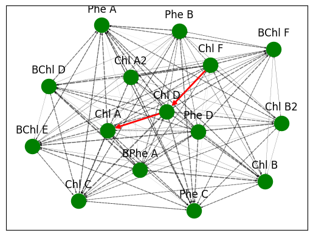

## __Spectral Pathfinding: Using A* to Navigate Chromophore Networks for FRET Design__

Ana Barrera-Jauregui: anabarrera_jauregui@berkeley.edu

Colman Bouton: clbouton@berkeley.edu

Alex Chase: achase95@berkeley.edu

Alison Jarvis: alison_jarvis@berkeley.edu

## Background

Förster resonance energy transfer (FRET) describes the energy transfer that can occur between a donor and acceptor chromophore (1). This transfer of energy depends on both the emission and absorbance profiles of both chromophores as well as their proximity. Common applications of FRET include determination of proteins conformations (2), protein-protein interactions (3), chemical sensors (4), and many more. FRET also occurs within nature, a notable example including chlorophyll and the energy transfers that occur to facilitate the production of energy. The PhotoChemCAD database provides spectral information for many different compounds relevant to photochemistry, including different chlorophylls (5). We utilized data from this site to produce a graph of different chlorophylls, and their interactions with one another via FRET. Nodes represent the individual chromophore variants, and edges represent the FRET efficiency between these molecules. High FRET efficiency (E) is desirable, so in order for this to equate to a low cost edge, the $-( \log (E))$ was taken. Additionally the graph is directed due to the required energy flow from a donor to an acceptor chromophore. The FRET efficiency is defined via the following equation. Where $r$ is the separation distance between the donor and the acceptor and $R_o$ is the Förster radius which describes the distance at which the energy transfer is 50% efficient.

$$E = \frac{1}{1 + \left(\dfrac{r}{R_0}\right)^6}$$

The Förster radius is a function of the spectral overlap, $J$, in the following form. 

$$R_0^6 = (0.211^6) \cdot \kappa ^2 \cdot Q_D \cdot n^{-4} \cdot J(\lambda)$$

Where $\kappa$ is the orientation factor, $Q_D$ is the quantum yield, $n$ is the refractive index of the medium, and $J(\lambda)$ is the spectral overlap integral. The spectral overlap is a function of the emission and absorption, and can be calculated as follows. 

$$
J = \int_0^\infty F_D (\lambda) \epsilon _A (\lambda) \lambda^4\, d\lambda
$$

Where $F_D$ is the normalized donor emission spectrum as a function of $\lambda$, $\epsilon _A$ is the acceptor molar extinction coefficient as a function of $\lambda$, and $\lambda$ is the wavelength. The molar extinction coefficient $\epsilon _A$ is proportional to the acceptor absorption, which is the data available in the photochemCAD database, as a function of the concentration of the medium. 

Therefore, we can make the approximation that $J_{rel}$, the numerical spectral integral we can calculate from the photochemCAD data, is proportional to $J$, which in turn is proportional to $R_0$, i.e.

$$J_{rel} \propto J \propto R_0^6$$

We can then use the concept that all other quantities are an arbitrary function of the concentration and solvent the fluorescent molecules exist in, to derive our approximation for $E$, which is a function of $J_{rel}$ and an arbitrary but consistent constant $C$. 

$$E = \frac{1}{1 + \left(\dfrac{C}{J_{rel}}\right)}$$

We calculate $J_{rel}$ from the spectral overlap of the emission and absorption from the emipirical data, which means we can use the natural chlorophyll database on photochemCAD to create the following graph. 

## Implementation of A* Search Algorithm

A* is an informed search, driven by heuristics, that is able to find the least-cost path from a source node to a target node (6). It maintains a priority queue with a cost function defined as $f(n) = g(n) + h(n)$ to guide the search. This algorithm is based upon Dijkstra's algorithm, which similarly utilizes a priority queue but where the cost function is defined as $f(n) = g(n)$ (7). Due to the inclusion of a heuristic function $h(n)$ the average time complexity for A* is often better compared to Dijkstra's. Dijkstra's algorithm will check all possible nodes within the connected component of the source and target nodes. In contrast, A* uses a heuristic function to estimate the cost from the current node in the path to the target node. With a reasonably effective heuristic function, the algorithm will need to check far fewer child nodes for each parent node along the path compared to Dijkstra's. Although in the worst case, time complexity for both algorithms is $O(E\log E)$ and the space complexity is $O(V)$. However in practice, due to the guiding nature of the heuristic function, A* has an average effective time complexity of $O(b^d)$ where $b$ is a branching factor that corresponds with the number of child nodes explored per parent node, and $d$ is the depth of the minimum cost search path. This makes A* oftentimes much more efficient at solving for the lowest cost path

## A* for Finding Lowest Cost FRET Pathway between Chlorophyll Variants

In our case, the lowest cost FRET pathway is one that maximizes FRET efficiency between a source chlorophyll and target chlorophyll molecule. Within our provided example code, we show how A* is used to find the lowest cost, highest efficiency path from Chlorophyll F to Chlorophyll A. These are biologically significant because Chlorophyll F is known to result in maximum attenuation and Chlorophyll A activates the electron transport chain for energy production within plants (8). Therefore they are reasonable candidates for a source donor and a target acceptor. We found the highest efficiency multi-step pathway between these two chromophore included an intermediate energy transfer with Chlorophyll D. While narrow in scope, this example highlights the potential use for path finding algorithms like A* in regard to finding the most photochemical pathways in a variety of applications.

## Limitations and Next Steps

## Code Execution

To run the A* algorithm to find the pathway from Chlorophyll F to Chlorophyll A, run the following bash command:

`run_path_tests.sh`

#### Team Contribution Statement

Ana Barrera-Jauregui: Attempted excitation graph representation from photochemCAD database to compare with absorbance/emission from selected chlorophyll strain. Introduced theory on FRET diagram on slides and replicated conceptual project scope to README.

Colman Bouton:
Derived/proposed edge weights of $-log(E_{fret})$. Developed utility script to assess $A*$ performance, accuracy against networkx implementation and Dijkstra's. Assessed the admissibility of proposed heuristic functions. Updated $A*$ implementation to cache heuristic function calls, revised $A*$ algorithm for readability, efficiency. Devised ultimate admissibility schema given quantum yield. Assisted with visualization of best path in chlorophyll graph.

Alex Chase:
Contributed to initial project planning for implementation of FRET with the A* search algorithm. Processed chromophore dataset to generate chromophore interaction graph based on percent overlap of peak absorbance/emission. Wrote the code for the A* search algorithm to identify highest yielding multi-step FRET pathways between a source and target chromophore within the graph. Provided explanation of the A* algorithm in contrast with Dijkstra's algorithm for the micropresentation slides. Provided background on FRET, A* search and biological applications for ReadMe.

Alison Jarvis: 
Compiled and contextualized equations for FRET, created code to calculate FRET spectral overlap from emission and absorption data, found photochemCAD database and determined how to parse data from it and sort by solvent. Created corresponding graph representation of chlorophylls in the Et20 solvent and preliminary graph visualization. Ran Djikstra and A-star on this graph and analyzed results. Provided explanation of graph representation and A-star applied to graph for presentation. Researched photosynthetic FRET pathways and real-world applications. 

## Sources

1) Wikipedia Contributors. (2019, September 20). Förster resonance energy transfer. Wikipedia; Wikimedia Foundation. https://en.wikipedia.org/wiki/F%C3%B6rster_resonance_energy_transfer

2) Lin, T., Scott, B. L., Hoppe, A. D., & Chakravarty, S. (2018). FRETting about the affinity of bimolecular protein–protein interactions. Protein Science, 27(10), 1850–1856. https://doi.org/10.1002/pro.3482

3) Heyduk, T. (2002). Measuring protein conformational changes by FRET/LRET. Current Opinion in Biotechnology, 13(4), 292–296. https://doi.org/10.1016/s0958-1669(02)00332-4

4) Awadhesh Kumar Verma, Ashab Noumani, Yadav, A. K., & Solanki, P. R. (2023). FRET Based Biosensor: Principle Applications Recent Advances and Challenges. Diagnostics, 13(8), 1375–1375. https://doi.org/10.3390/diagnostics13081375

5) PhotochemCAD. (n.d.). Www.photochemcad.com. https://www.photochemcad.com/

6) GeeksforGeeks. (2016, June 16). A* Search Algorithm. GeeksforGeeks. https://www.geeksforgeeks.org/dsa/a-search-algorithm/

7) GeeksforGeeks. (2012, November 25). Dijkstra’s Algorithm to find Shortest Paths from a Source to all. GeeksforGeeks. https://www.geeksforgeeks.org/dsa/dijkstras-shortest-path-algorithm-greedy-algo-7/

8) M. Kasım Şener, Johan Strümpfer, Hsin, J., Chandler, D. L., Scheuring, S., C. Neil Hunter, & Schulten, K. (2011). Förster Energy Transfer Theory as Reflected in the Structures of Photosynthetic Light‐Harvesting Systems. ChemPhysChem, 12(3), 518–531. https://doi.org/10.1002/cphc.201000944
